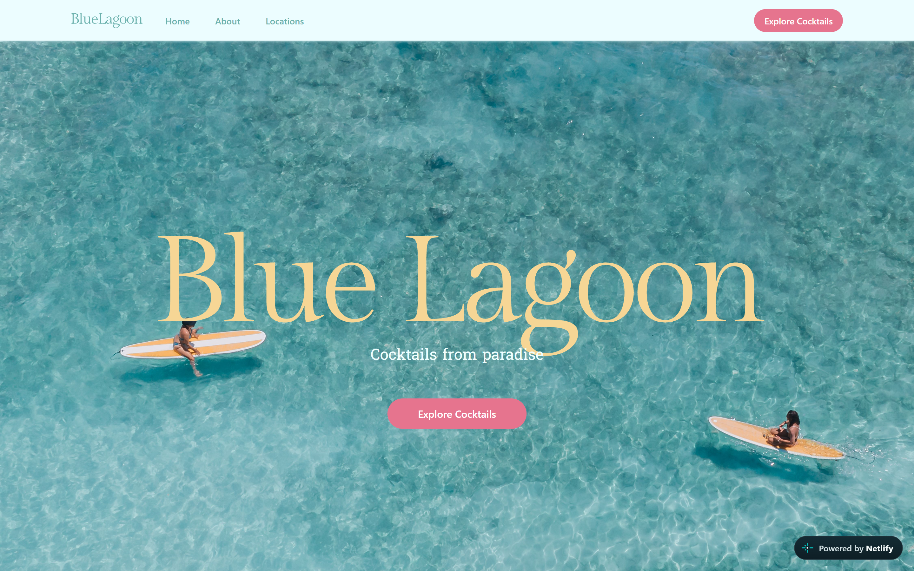
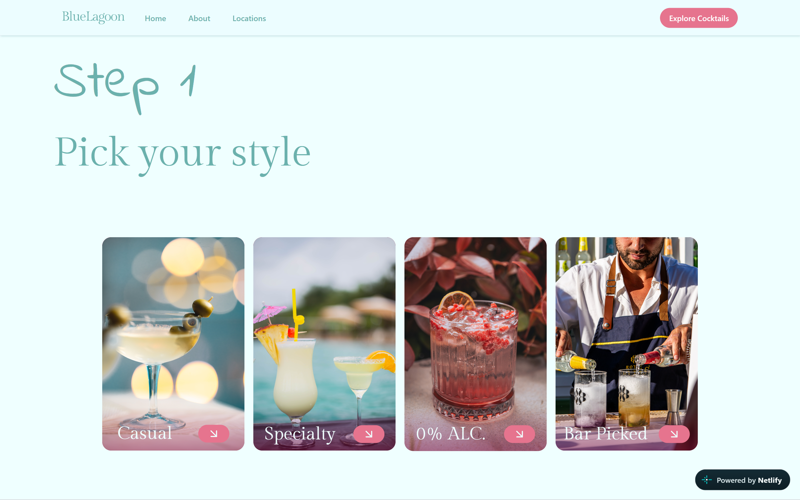

# Blue Lagoon

## Table of contents

- [Overview](#overview)
  - [Summary](#summary)
  - [Screenshot](#screenshot)
  - [Links](#links)
- [My process](#my-process)
  - [Built with](#built-with)
  - [What I learned](#what-i-learned)
  - [Continued development](#continued-development)
  - [Useful resources](#useful-resources)
## Overview

### Summary

A business website for a fictional cocktail bar by the name of 'Blue Lagoon'.
The website consists of common components About, Locations, and a fun interactive cocktail maker.

### Screenshot

### Links

- [Live Site URL](https://bluelagoon-cocktails.netlify.app/)

## My process

### Built with

- Mobile-first workflow
- React: Icons
- Taylwind styling
- Typescript
- Nodejs
- Vite

### What I learned

I learned to use tailwind css, once you understand the class names you begin to see the patterns and realize it's actually quite simple and convinient.
On the other hand I also learned that I should try to not bite more than I can chew. Complicated API React project + Typescript now that was quite the challenge.

### Continued development

Once I get the hang of Typescript I'd like to give this project a second look. Make it a more personal that allows you to have a profile and saves your faorite recipes.

### Useful resources

[Tailwind Main Website](https://tailwindcss.com/docs/) - Docs helped me understand class names
[API Cocktails Database](https://www.thecocktaildb.com/)- Provides data for the site
[React Typescript Tutorial ](https://youtu.be/665UnOGx3Pg?si=SE6jRc9oXZEI04nt) Helped me connect the missing dots
